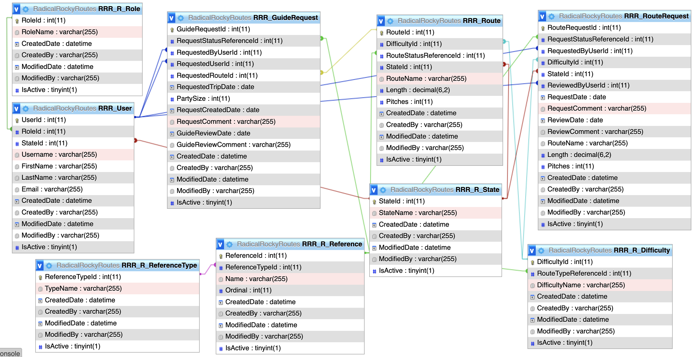
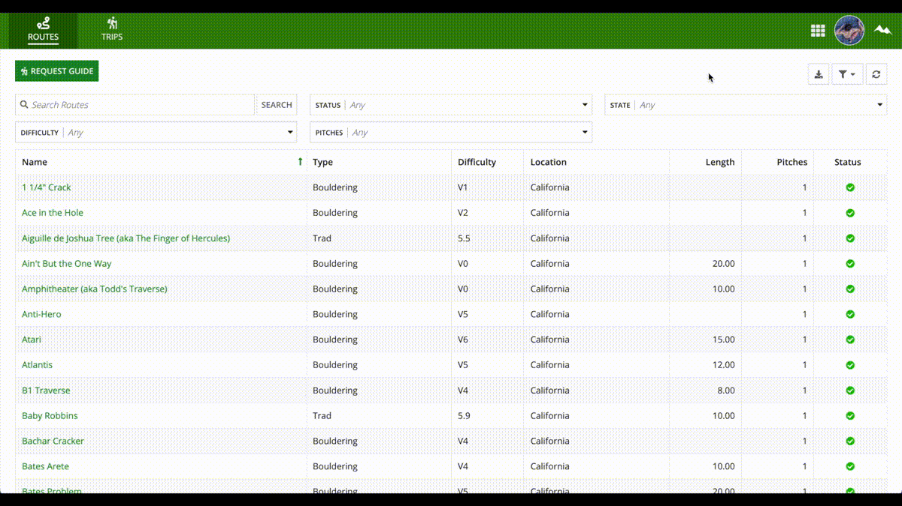
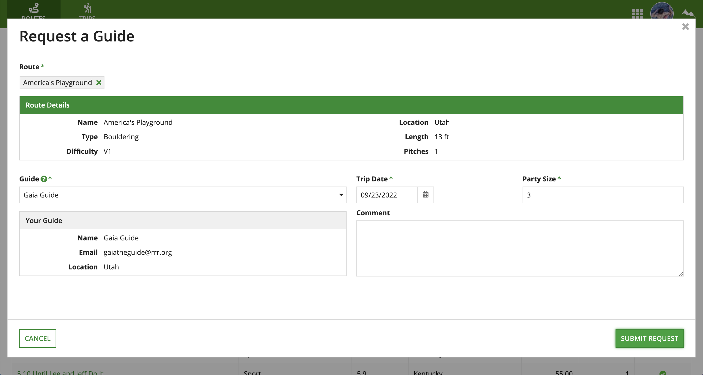
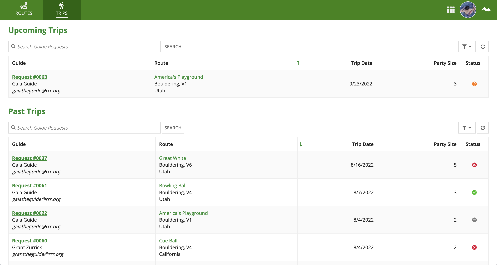
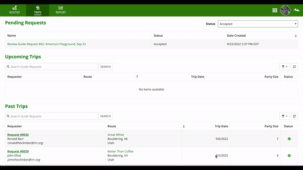
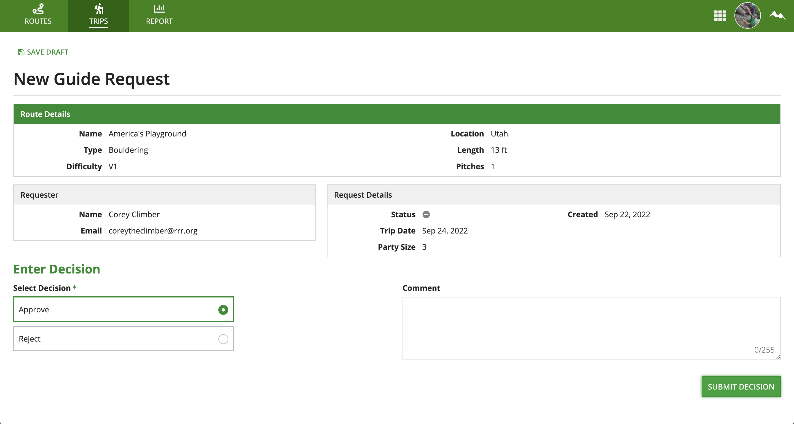
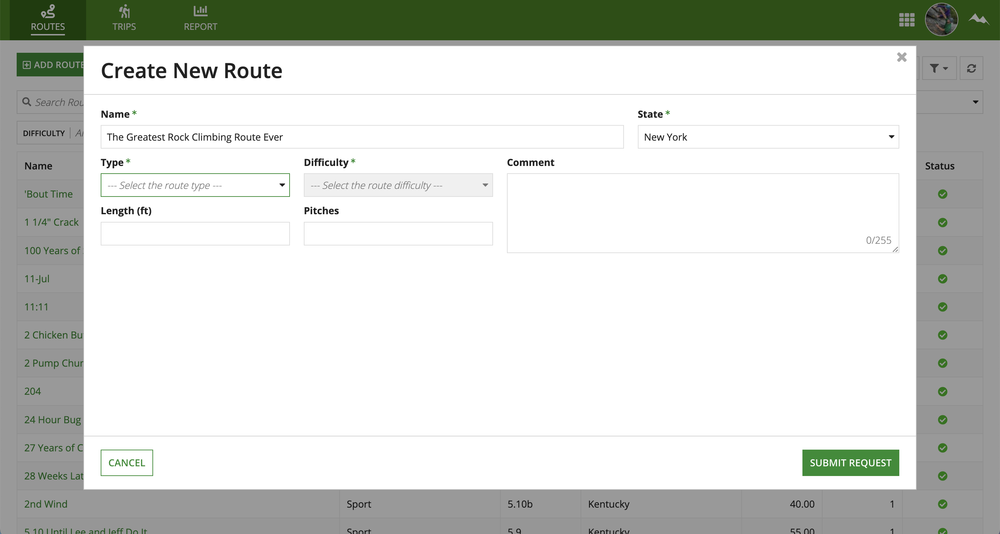
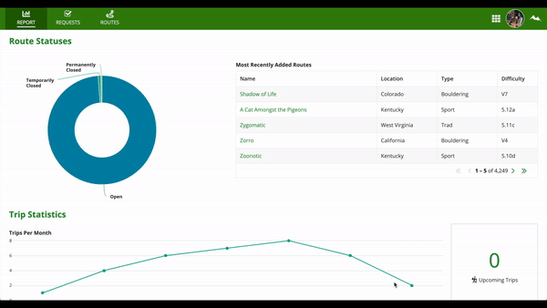
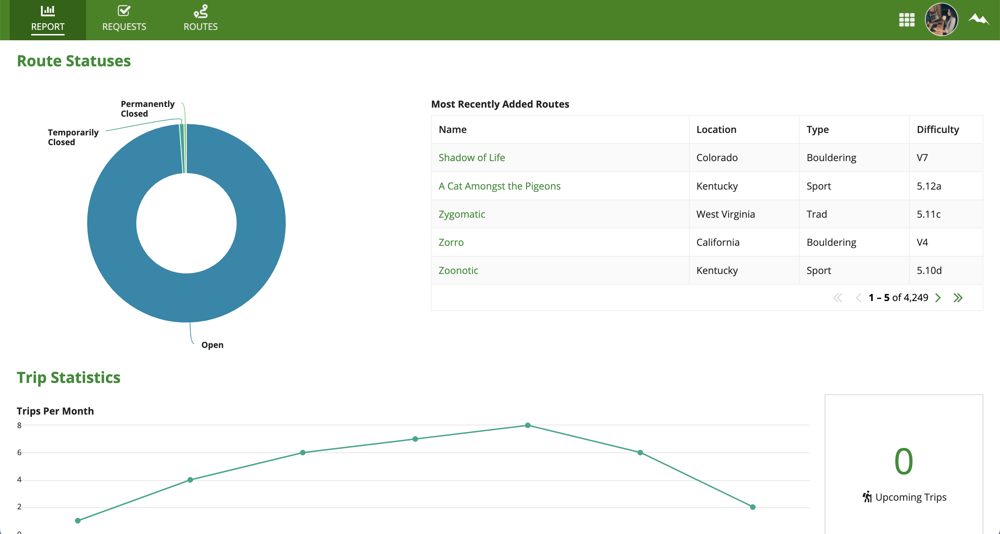
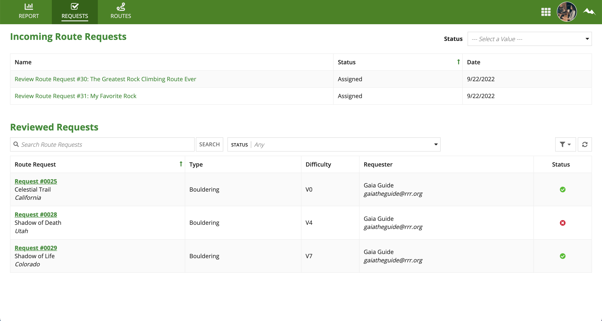

## Rock Climbing Site
Here is the database design (excluding views) with all foreign keys connected:

And then screenshots and GIFs of each individual role's capabilities (should be higher quality):

Climber:

Guide:

Admin:

