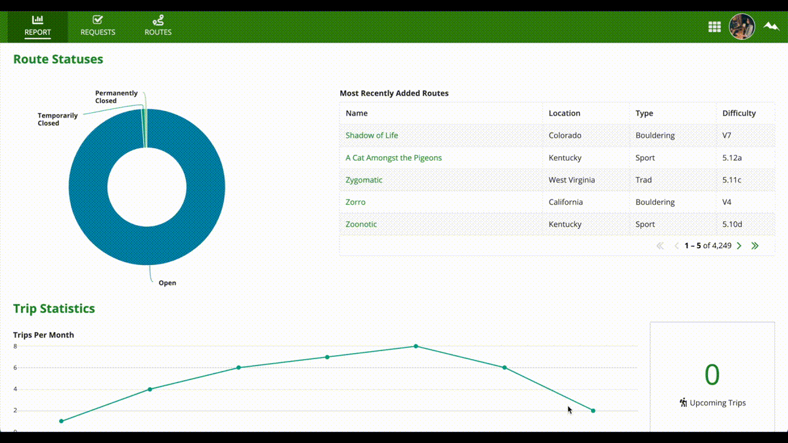

## Rock Climbing Site
Here is the database design (excluding views) with all foreign keys connected:
  

And then screenshots and GIFs of each individual role's capabilities (should be higher quality):

 
Climber:
  
  
  

 
Guide:
  
  
  

 
Admin:
  
  
  