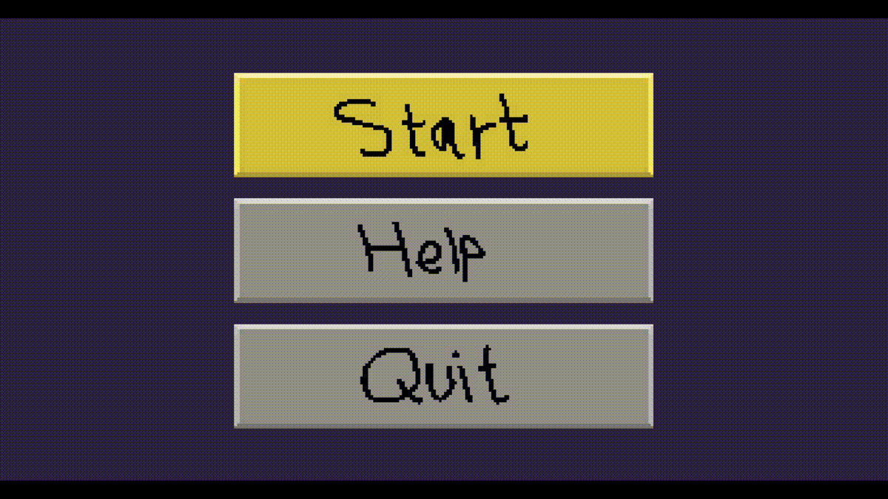
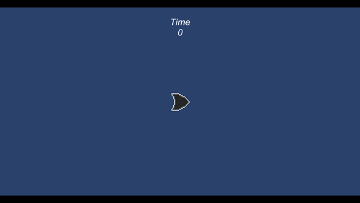
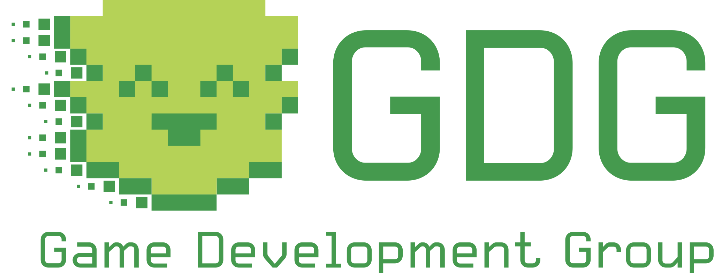

# Hi, I'm Liz!
I’m senior at Binghamton University pursuing a double-degree in Computer Science and Mathematics. Here are some cool things I've done!

[Video Games](#video-games)  
[Programming Projects](#programming-projects)  
[Applications](#applications)  
[Game Development Group](#game-development-group)  

## Video Games

### Curious Cats
A 2D puzzle game me and a partner created in Unity with C#. 
 It houses original pixel art assets and was made within a month for the GameOff 2022 game jam!
 My role was the artist and UI programmer. I created all sprites and animations and integrated them into the code properly. I designed the UI, created all sprites for UI elements, and ensured that the interface was easy and satisfying to use. I'm really happy with how it turned out, from the custom cursor to the bouncy buttons!
  [See more info and source code.](https://github.com/E-Potapova/GameOff2022)
#### [Play the game right now!](https://e-potapova.itch.io/curious-cats) 

#### Little Trouble [:top:](#hi-im-liz)
This is a small platformer video game me and a partner created in Unity (in C#). 
 It is a 2D metroidvania with original pixel art assets made within a month for the GameOff 2021 game jam.
  I personally was the project lead and asset developer. I organized responsibilities, set up deadlines, designed ability flavors (i.e. the double jump being a pair of maple tree seeds), designed UI, and created *all* art assets.
  [See more info and source code.](https://github.com/E-Potapova/GameOff2021)
#### [Play the game right now!](https://e-potapova.itch.io/little-trouble) 
*Might need to zoom out in the browser and then make the game full-screen to see all UI elements.

### I Can't Believe It's Not Breakout [:top:](#hi-im-liz)
A small game in Unity that furthered my knowledge on scenes, object spawning, and event management.
  The blocks spawn with a chance of providing an effect: giving +1 ball to the player (orange), freezing the paddle (blue), or speeding up all balls x2 (yellow).
  (This is a very original game not at all related to *Breakout* by Atari.)

### Definitely Not Asteroids [:top:](#hi-im-liz)
The very first game I made in Unity, the game is not pretty but taught me a lot of important things.
  Oh, and it's *not* at all similar to *Asteroids* by Atari, I have no idea what you're talking about ... 

## Programming Projects
### Procedurally-Generated Landscapes in OpenGL [:top:](#hi-im-liz)
Capstone project for my Computer Graphics course made with one other teammate. We generate a 2D Perlin noise map and display it on-screen for the user to see. The user can modify the density of the map and generate a new one entirely.

From the noise map we construct a rough 'landscape' by dividing the 2D map into squares, from which we draw a rectangular prism with the height corresponding to the color value of the noise. White means taller, black means shorter. The user has options for voxel cubes instead of rectangular prisms, which pixel is used to determine the height (upper-left, center, or average), and color schemes.. we added Minecraft for fun. :) [See source code.](OpenGL%20Project/)
 

### Cache Simulator
Made for my Computer Architecture III course, this project simulates six different types of cache organization systems and tests them with varying parameters on large traces of memory instructions.
 - Direct-mapped
    - Cache line: 32 bytes, cache sizes tested: 1KB, 4KB, 16KB, 32KB
 - Set-associative
    - Cache line: 32 bytes, cache size: 16KB
    - Associativity tested: 2, 4, 8, 16, least-recently-used replacement
 - Fully-associative
    - Cache line: 32 bytes, cache size: 16KB
    - Least-recently-used (LRU) replacement policy & hot-cold LRU approximation
 - Set-associative, no allocation on write miss
    - Cache line: 32 bytes, cache size: 16KB
    - Associativity tested: 2, 4, 8, 16, least-recently-used replacement
    - If a store instruction misses, the missing line is written directly into memory instead of cache
 - Set-associative with next-line prefetching
    - Cache line: 32 bytes, cache size: 16KB
    - Associativity tested: 2, 4, 8, 16, least-recently-used replacement
    - For any cache access, bring next line into cache as well
 - Set-associative with next-line prefetching only on cache miss
    - Cache line: 32 bytes, cache size: 16KB
    - Associativity tested: 2, 4, 8, 16, least-recently-used replacement
    - When accessing the cache and missing, bring next line into cache as well

Source code available for view upon request.

## Applications
### Rock Climbing Site [:top:](#hi-im-liz)
For my 2022 summer internship, me and 2 other interns had to develop a simple application within 2 weeks based on a user story. A big focus was proper communication with its database.
  Our application has three roles: Climber, Guide, and Administrator. Climbers can view routes across the U.S. and request a guide to take them through that route. Guides approve or reject requests and can add new routes to the database. Admins approve additions and have a dashboard with various reports.
  I personally worked a lot on the 'Climber requests a Guide' aspect, as well as making sure the user experience and UI was at its best.
[See more info here.](Internship%20Site/)  

## Game Development Group 
I was quite disappointed to not find *any* resources at my university regarding game development—so I took things into my own hands and founded a new club dedicated for creating games!

I had my first event, which was an talk on what's needed to start making games. I will also be running a series of workshops for learning Unity and creating a game from scratch! Most excitedly, we are trying to organize Binghamton University's first-ever game jam in November!

More cool things to come!
 
