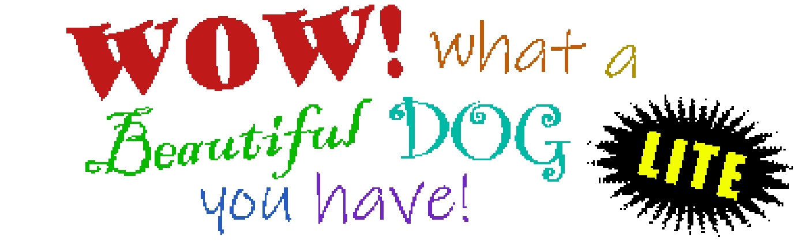
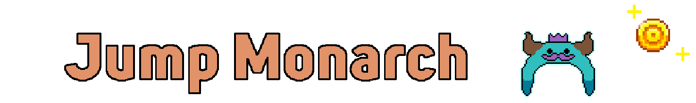
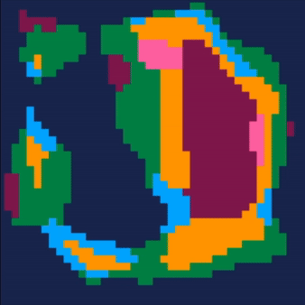
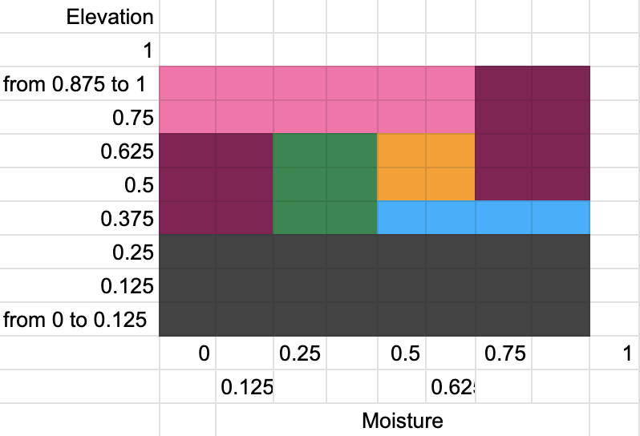

# Hi, I'm Liz!
I’m a recent graduate from Binghamton University studying Computer Science. Here are some cool things I've done!
- [Video Games](#video-games)  
    - Wow! What a Beautiful Dog You Have! LITE (tower defense for mobile)  
    - Jump Monarch (endless scroller for mobile)  
    - Curious Cats (2D point-and-click)  
    - Little Trouble (2D platformer)  
- [Programming Projects](#programming-projects)  
    - Map with Biome Generation using Perlin Noise in PICO-8  
    - Procedurally-Generated Landscapes in OpenGL  
    - Cache Simulator  
- [Applications](#applications)  
    - Rock Climbing Site  
- [Game Development Group](#game-development-group)  

## Video Games

### Wow! What a Beautiful Dog You Have! LITE
<i>Apr-May 2024  
Skills: Java, Android Studio, LibGDX </i>

WWABDYHL is a small tower defense game for mobile I made in a team of two. We used Android Studio with the LibGDX library for basic graphics that can be exported for both iOS and Android. 

All game mechanics (collisions, enemy selection, pathing, particles, health, currency, etc.) were programmed from scratch in Java. All assets except music & fonts were created ourselves!

[Browse some of the classes I worked on!](./WWABDYHL/README.md)

  

 
 

### Jump Monarch
<i>Mar-Apr 2024  
Skills: Java, Android Studio, LibGDX </i>

This is a small and simple mobile game I created solo in Android Studio using Java. It's one of those endless scroller games where you try to climb up endlessly and reach a new high score.

I used LibGDX for drawing images on-screen, but otherwise everything was programmed from scratch: moving the player, detecting collisions, drawing each particle, spawning the coins and spikes, and more.

[Browse some of the source code!](./Jump%20Monarch/README.md)

  

 
 

### Curious Cats
<i>Nov 2022  
Skills: Unity, C#, Clip Studio Paint </i>

A 2D puzzle game me and a partner created in Unity with C#. 

It houses original pixel art assets and was made within a month for the GameOff 2022 game jam!

My role was the artist and UI programmer. I created all sprites and animations and integrated them into the code properly. I designed the UI, created all sprites for UI elements, and ensured that the interface was easy and satisfying to use. I'm really happy with how it turned out, from the custom cursor to the bouncy buttons!

[See more info and source code.](https://github.com/E-Potapova/GameOff2022)
#### [Play the game right now!](https://e-potapova.itch.io/curious-cats) 

### Little Trouble [:top:](#hi-im-liz)
<i>Nov 2021  
Skills: Unity, C#, Clip Studio Paint </i>

This is a small platformer video game me and a partner created in Unity (in C#). 

It is a 2D metroidvania with original pixel art assets made within a month for the GameOff 2021 game jam.

I personally was the project lead and asset developer. I organized responsibilities, set up deadlines, designed ability flavors (i.e. the double jump being a pair of maple tree seeds), designed UI, and created *all* art assets.

[See more info and source code.](https://github.com/E-Potapova/GameOff2021)
#### [Play the game right now!](https://e-potapova.itch.io/little-trouble) 
*Might need to zoom out in the browser and then make the game full-screen to see all UI elements.

## Programming Projects
### Map with Biome Generation using Perlin Noise in PICO-8 [:top:](#hi-im-liz)
<i>Feb 2024  
Skills: Lua, PICO-8 </i>

Playing around with map generation and layering noise maps for smooth biomes. Created in the PICO-8 engine, which uses Lua; each pixel in the displayed gif would correlate to a chunk of the map that can be scaled up to any size. 

Techniques I used:
 - Layering together two separate noise maps (elevation and moisture) to choose biomes
 - Using 3 octaves for both noise maps, offsetting the noise values being fetched so that they are independent
 - 1st octave gets tapered out at edges using the square bump distance function

    
    

### Procedurally-Generated Landscapes in OpenGL [:top:](#hi-im-liz)
<i>Apr-May 2023  
Skills: C++, OpenGL </i>

Capstone project for my Computer Graphics course made with one other teammate. We generate a 2D Perlin noise map and display it on-screen for the user to see. The user can modify the density of the map and generate a new one entirely.

From the noise map we construct a rough 'landscape' by dividing the 2D map into squares, from which we draw a rectangular prism with the height corresponding to the color value of the noise. White means taller, black means shorter. The user has options for voxel cubes instead of rectangular prisms, which pixel is used to determine the height (upper-left, center, or average), and color schemes.. we added Minecraft for fun. :) 

[Browse the source code!](OpenGL%20Project/)

### Cache Simulator
<i>Nov 2022  
Skills: C++, Makefile </i>

Made for my Computer Architecture III course, this project simulates six different types of cache organization systems and tests them with varying parameters on large traces of memory instructions.
 - Direct-mapped
    - Cache line: 32 bytes, cache sizes tested: 1KB, 4KB, 16KB, 32KB
 - Set-associative
    - Cache line: 32 bytes, cache size: 16KB
    - Associativity tested: 2, 4, 8, 16, least-recently-used replacement
 - Fully-associative
    - Cache line: 32 bytes, cache size: 16KB
    - Least-recently-used (LRU) replacement policy & hot-cold LRU approximation
 - Set-associative, no allocation on write miss
    - Cache line: 32 bytes, cache size: 16KB
    - Associativity tested: 2, 4, 8, 16, least-recently-used replacement
    - If a store instruction misses, the missing line is written directly into memory instead of cache
 - Set-associative with next-line prefetching
    - For any cache access, bring next line into cache as well
 - Set-associative with next-line prefetching only on cache miss
    - When accessing the cache and missing, bring next line into cache as well

Source code available for view upon request.

## Applications
### Rock Climbing Site [:top:](#hi-im-liz)
<i>July 2022  
Skills: Appian, MariaDB, MySQL </i>

For my 2022 summer internship, me and 2 other interns had to develop a simple application within 2 weeks based on a user story. A big focus was proper communication with its database.

Our application has three roles: Climber, Guide, and Administrator. Climbers can view routes across the U.S. and request a guide to take them through that route. Guides approve or reject requests and can add new routes to the database. Admins approve additions and have a dashboard with various reports.

I personally worked a lot on the 'Climber requests a Guide' aspect, as well as making sure the user experience and UI was at its best.

[See more info here.](Internship%20Site/README.md)  

## Game Development Group 
<i>Aug 2023 - May 2024  
Skills: Leadership, Organization, Self-Motivation </i>

I was quite disappointed to not find *any* resources at my university regarding game development—so I took things into my own hands and founded a new club dedicated for creating games!

Fall 2023 had a series of beginner Unity workshops, a talk on how to get started making games, and a 48-hour game jam hosted on campus, all created and organized by me! 

Spring 2024 had a proper team hosting 2 workshops weekly for a variety of game engines and tools (Unity, PICO-8, GameMaker, Blender, Twine, etc.) and another 48-hour game jam in April!

 
