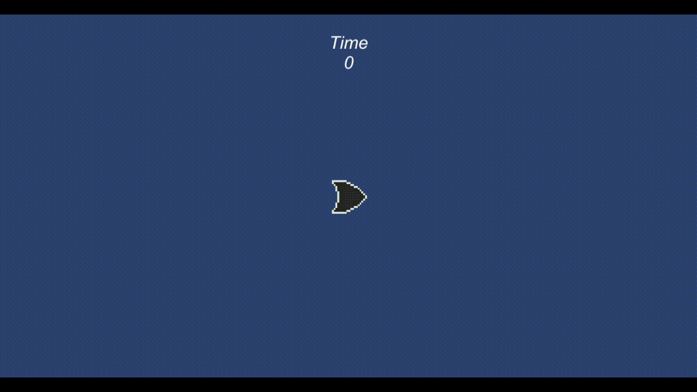

# Hi, I'm Liz!
I’m senior at Binghamton University pursuing a double-degree in Computer Science and Mathematics. Here are some cool things I've done!

[Video Games](#video-games)  
[Programming Projects](#programming-projects)  
[Applications](#applications)  
[Game Development Group](#game-development-group)  

## Video Games
### Curious Cats
A 2D puzzle game me and a partner created in Unity with C#. 
 It houses original pixel art assets and was made within a month for the GameOff 2022 game jam!
 My role was the artist and UI programmer. I created all sprites and animations and integrated them into the code properly. I designed the UI, created all sprites for UI elements, and ensured that the interface was easy and satisfying to use. I'm really happy with how it turned out, from the custom cursor to the bouncy buttons!
  [See more info and source code.](https://github.com/E-Potapova/GameOff2022)
#### [Play the game right now!](https://e-potapova.itch.io/curious-cats) 

### Little Trouble [:top:](#hi-im-liz)
This is a small platformer video game me and a partner created in Unity (in C#). 
 It is a 2D metroidvania with original pixel art assets made within a month for the GameOff 2021 game jam.
  I personally was the project lead and asset developer. I organized responsibilities, set up deadlines, designed ability flavors (i.e. the double jump being a pair of maple tree seeds), designed UI, and created *all* art assets.
  [See more info and source code.](https://github.com/E-Potapova/GameOff2021)
#### [Play the game right now!](https://e-potapova.itch.io/little-trouble) 
*Might need to zoom out in the browser and then make the game full-screen to see all UI elements.
 

### I Can't Believe It's Not Breakout [:top:](#hi-im-liz)
A small game in Unity that furthered my knowledge on scenes, object spawning, and event management.
  The blocks spawn with a chance of providing an effect: giving +1 ball to the player (orange), freezing the paddle (blue), or speeding up all balls x2 (yellow).
  (This is a very original game not at all related to *Breakout* by Atari.)
 

### Definitely Not Asteroids [:top:](#hi-im-liz)
The very first game I made in Unity, the game is not pretty but taught me a lot of important things.
  Oh, and it's *not* at all similar to *Asteroids* by Atari, I have no idea what you're talking about ... 
 

## Applications
### Rock Climbing Site [:top:](#hi-im-liz)
For my 2022 summer internship, me and 2 other interns had to develop a simple application within 2 weeks based on a user story. A big focus was proper communication with its database.
  Our application has three roles: Climber, Guide, and Administrator. Climbers can view routes across the U.S. and request a guide to take them through that route. Guides approve or reject requests and can add new routes to the database. Admins approve additions and have a dashboard with various reports.
  I personally worked a lot on the 'Climber requests a Guide' aspect, as well as making sure the user experience and UI was at its best.
[See more info here.](Internship%20Site/)  

## Programming Projects
### Sports Player Manager [:top:](#hi-im-liz)
As part of my Data Structures course, I had to create custom C++ classes that used *only* dynamic storage (i.e. no arrays or vectors) to create and manage a League of Teams, each of which had unique Players. The program needed to have zero memory leaks.
[See more here.](Player%20Manager/)

### Integer Set [:top:](#hi-im-liz)
Created for my Computer Architecure II class, the set for integers was made in C with a focus on proper pointer and memory management. The set was implemented using a linked list and had these requirements: no duplicate items, can add an array of ints to the set, can create a union of two sets, can create an intersection of two sets.
[See more.](Integer%20Set/)

## Game Development Group 
I was quite disappointed to not find *any* resources at my university regarding game development—so I took things into my own hands and founded a new club dedicated for creating games!
